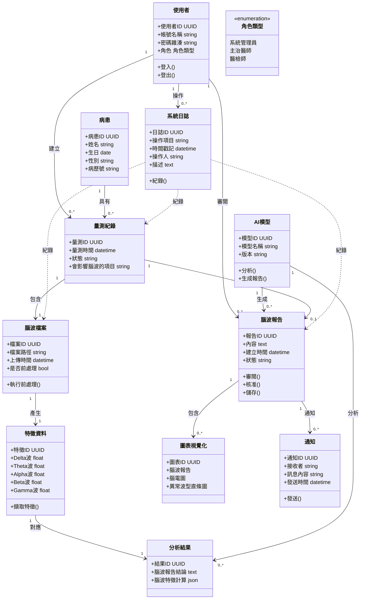
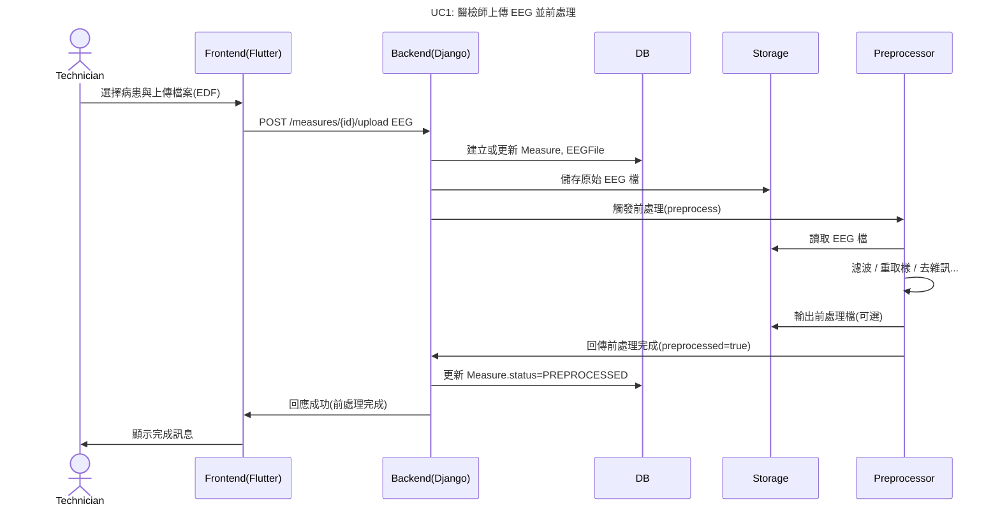
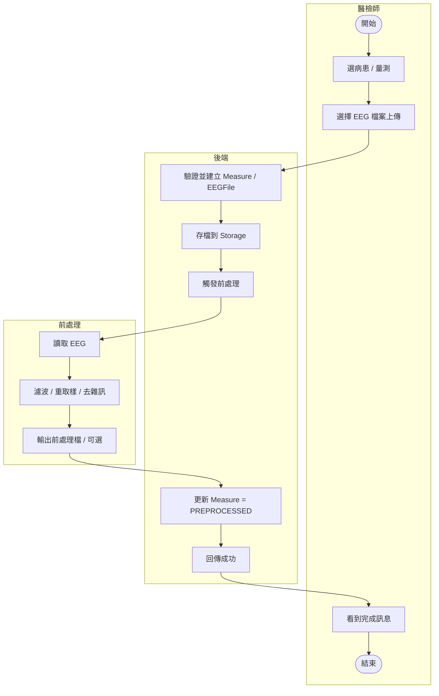
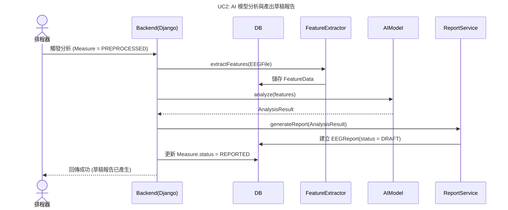
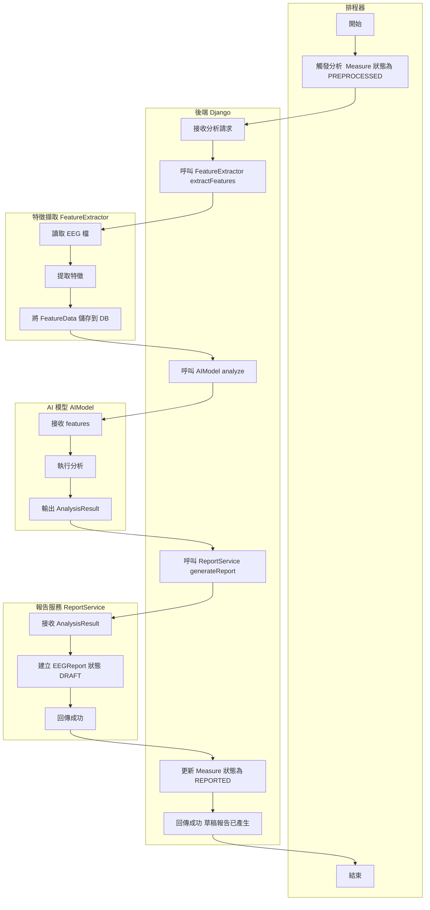
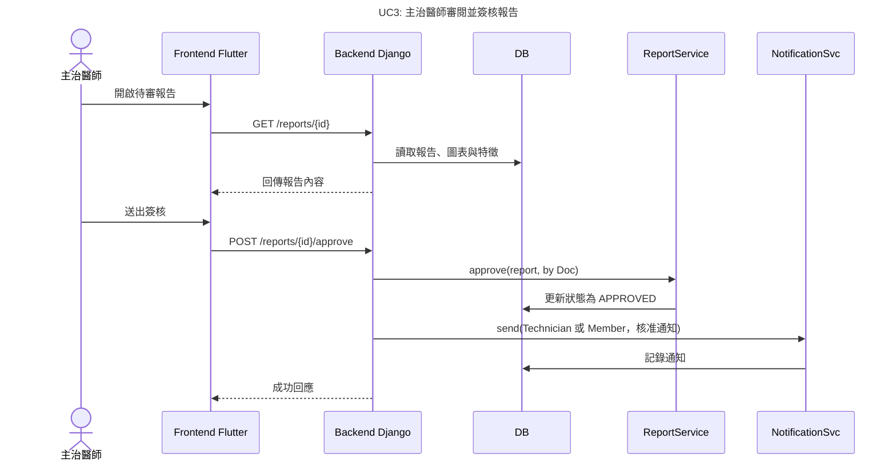
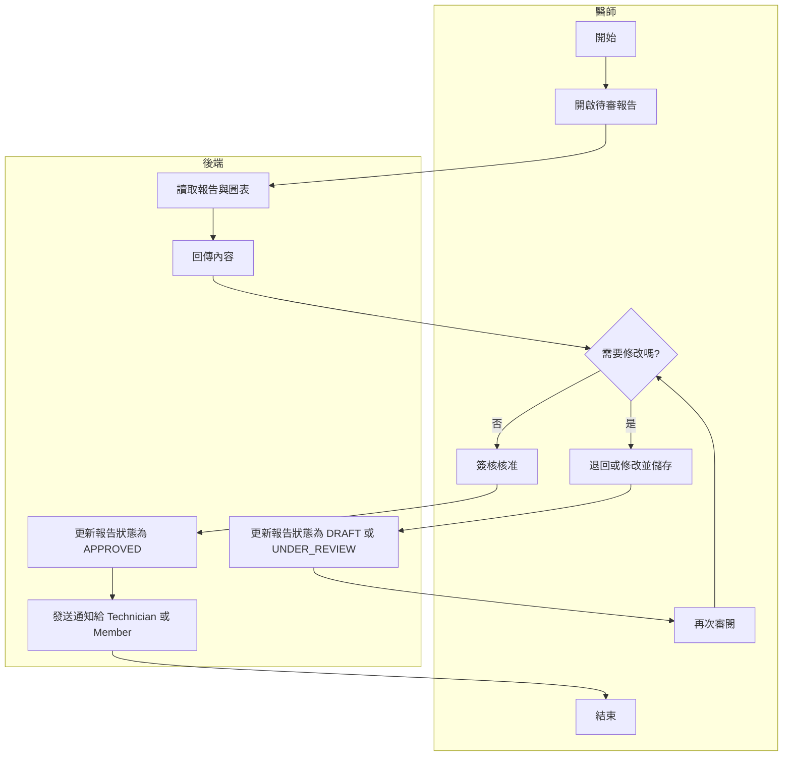

## UML類別圖

```mermaid
classDiagram
    direction TB
    class 使用者 {
        +使用者ID UUID
        +帳號名稱 string
        +密碼雜湊 string
        +角色 角色類型
        +登入()
        +登出()
    }

    class 角色類型 {
        <<enumeration>>
        系統管理員
        主治醫師
        醫檢師
    }

    class 病患 {
        +病患ID UUID
        +姓名 string
        +生日 date
        +性別 string
        +病歷號 string
    }

    class 量測紀錄 {
        +量測ID UUID
        +量測時間 datetime
        +狀態 string
        +會影響腦波的項目 string
    }

    class 腦波檔案 {
        +檔案ID UUID
        +檔案路徑 string
        +上傳時間 datetime
        +是否前處理 bool
        +執行前處理()
    }

    class 特徵資料 {
        +特徵ID UUID
        +Delta波 float
        +Theta波 float
        +Alpha波 float
        +Beta波 float
        +Gamma波 float
        +擷取特徵()
    }

    class AI模型 {
        +模型ID UUID
        +模型名稱 string
        +版本 string
        +分析()
        +生成報告()
    }

    class 分析結果 {
        +結果ID UUID
        +腦波報告結論 text
        +腦波特徵計算 json
    }

    class 腦波報告 {
        +報告ID UUID
        +內容 text
        +建立時間 datetime
        +狀態 string
        +審閱()
        +核准()
        +儲存()
    }

    class 圖表視覺化 {
        +圖表ID UUID
        +腦波報告
        +腦電圖
        +異常波型直條圖
    }

    class 通知 {
        +通知ID UUID
        +接收者 string
        +訊息內容 string
        +發送時間 datetime
        +發送()
    }

    class 系統日誌 {
        +日誌ID UUID
        +操作項目 string
        +時間戳記 datetime
        +操作人 string
        +描述 text
        +紀錄()
    }

    %% 關聯關係
    使用者 "1" --> "0..*" 量測紀錄 : 建立
    使用者 "1" --> "0..*" 腦波報告 : 審閱
    使用者 "1" --> "0..*" 系統日誌 : 操作

    病患 "1" --> "0..*" 量測紀錄 : 具有
    量測紀錄 "1" --> "1" 腦波檔案 : 包含
    腦波檔案 "1" --> "1" 特徵資料 : 產生
    特徵資料 "1" --> "1" 分析結果 : 對應
    AI模型 "1" --> "0..*" 分析結果 : 分析
    AI模型 "1" --> "0..*" 腦波報告 : 生成

    量測紀錄 "1" --> "0..1" 腦波報告 : 產生
    腦波報告 "1" --> "0..*" 圖表視覺化 : 包含
    腦波報告 "1" --> "0..*" 通知 : 通知

    系統日誌 ..> 量測紀錄 : 紀錄
    系統日誌 ..> 腦波報告 : 紀錄
    系統日誌 ..> 腦波檔案 : 紀錄
```

## 醫檢師上傳 EEG 並前處理

### 循序圖

```mermaid
sequenceDiagram
    title UC1: 醫檢師上傳 EEG 並前處理
    actor Technician
    participant UI as Frontend(Flutter)
    participant API as Backend(Django)
    participant DB as DB
    participant FS as Storage
    participant PP as Preprocessor

    Technician ->> UI: 選擇病患與上傳檔案(EDF)
    UI ->> API: POST /measures/{id}/upload EEG
    API ->> DB: 建立或更新 Measure, EEGFile
    API ->> FS: 儲存原始 EEG 檔
    API ->> PP: 觸發前處理(preprocess)
    PP ->> FS: 讀取 EEG 檔
    PP ->> PP: 濾波 / 重取樣 / 去雜訊...
    PP ->> FS: 輸出前處理檔(可選)
    PP ->> API: 回傳前處理完成(preprocessed=true)
    API ->> DB: 更新 Measure.status=PREPROCESSED
    API ->> UI: 回應成功(前處理完成)
    UI ->> Technician: 顯示完成訊息
```

### 活動圖

```mermaid

flowchart TD
    subgraph lane_tech[醫檢師]
        A1([開始])
        A2[選病患 / 量測]
        A3[選擇 EEG 檔案上傳]
        A4[看到完成訊息]
        A5([結束])
    end

    subgraph lane_backend[後端]
        B1[驗證並建立 Measure / EEGFile]
        B2[存檔到 Storage]
        B3[觸發前處理]
        B4[更新 Measure = PREPROCESSED]
        B5[回傳成功]
    end

    subgraph lane_preproc[前處理]
        C1[讀取 EEG]
        C2[濾波 / 重取樣 / 去雜訊]
        C3[輸出前處理檔 / 可選]
    end

    A1 --> A2 --> A3 --> B1
    B1 --> B2 --> B3 --> C1
    C1 --> C2 --> C3 --> B4
    B4 --> B5 --> A4 --> A5
```

## AI 分析與產出草稿報告
### 循序圖

```mermaid
sequenceDiagram
    %% UC2: AI 模型分析與產出草稿報告
    title UC2: AI 模型分析與產出草稿報告

    actor Scheduler as 排程器
    participant API as Backend(Django)
    participant DB as DB
    participant FE as FeatureExtractor
    participant AIM as AIModel
    participant RS as ReportService

    Scheduler ->> API: 觸發分析 (Measure = PREPROCESSED)
    API ->> FE: extractFeatures(EEGFile)
    FE ->> DB: 儲存 FeatureData
    API ->> AIM: analyze(features)
    AIM -->> API: AnalysisResult
    API ->> RS: generateReport(AnalysisResult)
    RS ->> DB: 建立 EEGReport(status = DRAFT)
    API ->> DB: 更新 Measure.status = REPORTED
    API -->> Scheduler: 回傳成功 (草稿報告已產生)
```

### 活動圖

```mermaid
flowchart TD
    subgraph lane_scheduler[排程器]
        A1[開始]
        A2[觸發分析  Measure 狀態為 PREPROCESSED]
        A9[結束]
    end

    subgraph lane_backend[後端 Django]
        B1[接收分析請求]
        B2[呼叫 FeatureExtractor extractFeatures]
        B3[呼叫 AIModel analyze]
        B4[呼叫 ReportService generateReport]
        B5[更新 Measure 狀態為 REPORTED]
        B6[回傳成功  草稿報告已產生]
    end

    subgraph lane_fe[特徵擷取 FeatureExtractor]
        C1[讀取 EEG 檔]
        C2[提取特徵]
        C3[將 FeatureData 儲存到 DB]
    end

    subgraph lane_aim[AI 模型 AIModel]
        D1[接收 features]
        D2[執行分析]
        D3[輸出 AnalysisResult]
    end

    subgraph lane_rs[報告服務 ReportService]
        E1[接收 AnalysisResult]
        E2[建立 EEGReport 狀態 DRAFT]
        E3[回傳成功]
    end

    A1 --> A2 --> B1
    B1 --> B2 --> C1
    C1 --> C2 --> C3 --> B3
    B3 --> D1 --> D2 --> D3 --> B4
    B4 --> E1 --> E2 --> E3 --> B5
    B5 --> B6 --> A9
```

## 醫生審閱簽核與通知
### 循序圖

```mermaid
sequenceDiagram
    %% UC3: 主治醫師審閱並簽核報告                
    title UC3: 主治醫師審閱並簽核報告

    actor Doc as 主治醫師
    participant UI as Frontend Flutter
    participant API as Backend Django
    participant DB as DB
    participant RS as ReportService
    participant NS as NotificationSvc

    Doc ->> UI: 開啟待審報告
    UI ->> API: GET /reports/{id}
    API ->> DB: 讀取報告、圖表與特徵
    API -->> UI: 回傳報告內容
    Doc ->> UI: 送出簽核
    UI ->> API: POST /reports/{id}/approve
    API ->> RS: approve(report, by Doc)
    RS ->> DB: 更新狀態為 APPROVED
    API ->> NS: send(Technician 或 Member，核准通知)
    NS ->> DB: 記錄通知
    API -->> UI: 成功回應
```

### 活動圖

```mermaid
flowchart TD
    %% UC3 活動圖：醫師審閱簽核與通知

    subgraph lane_doc[醫師]
        A1[開始]
        A2[開啟待審報告]
        A3{需要修改嗎?}
        A4[退回或修改並儲存]
        A5[再次審閱]
        A6[簽核核准]
        A7[結束]
    end

    subgraph lane_backend[後端]
        B1[讀取報告與圖表]
        B2[回傳內容]
        B3[更新報告狀態為 DRAFT 或 UNDER_REVIEW]
        B4[更新報告狀態為 APPROVED]
        B5[發送通知給 Technician 或 Member]
    end

    %% 主流程
    A1 --> A2 --> B1 --> B2 --> A3

    %% while 迴圈（修改流程）
    A3 -- 是 --> A4 --> B3 --> A5 --> A3

    %% 簽核核准流程
    A3 -- 否 --> A6 --> B4 --> B5 --> A7
```
