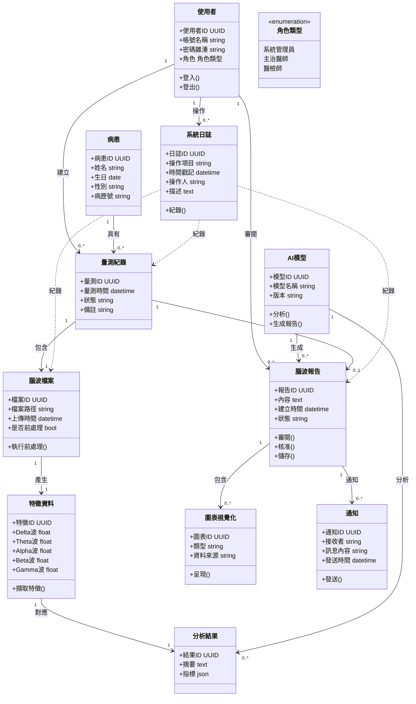

## UML類別圖

```mermaid
classDiagram
    direction TB
    class 使用者 {
        +使用者ID UUID
        +帳號名稱 string
        +密碼雜湊 string
        +角色 角色類型
        +登入()
        +登出()
    }

    class 角色類型 {
        <<enumeration>>
        系統管理員
        主治醫師
        醫檢師
    }

    class 病患 {
        +病患ID UUID
        +姓名 string
        +生日 date
        +性別 string
        +病歷號 string
    }

    class 量測紀錄 {
        +量測ID UUID
        +量測時間 datetime
        +狀態 string
        +備註 string
    }

    class 腦波檔案 {
        +檔案ID UUID
        +檔案路徑 string
        +上傳時間 datetime
        +是否前處理 bool
        +執行前處理()
    }

    class 特徵資料 {
        +特徵ID UUID
        +Delta波 float
        +Theta波 float
        +Alpha波 float
        +Beta波 float
        +Gamma波 float
        +擷取特徵()
    }

    class AI模型 {
        +模型ID UUID
        +模型名稱 string
        +版本 string
        +分析()
        +生成報告()
    }

    class 分析結果 {
        +結果ID UUID
        +摘要 text
        +指標 json
    }

    class 腦波報告 {
        +報告ID UUID
        +內容 text
        +建立時間 datetime
        +狀態 string
        +審閱()
        +核准()
        +儲存()
    }

    class 圖表視覺化 {
        +圖表ID UUID
        +類型 string
        +資料來源 string
        +呈現()
    }

    class 通知 {
        +通知ID UUID
        +接收者 string
        +訊息內容 string
        +發送時間 datetime
        +發送()
    }

    class 系統日誌 {
        +日誌ID UUID
        +操作項目 string
        +時間戳記 datetime
        +操作人 string
        +描述 text
        +紀錄()
    }

    %% 關聯關係
    使用者 "1" --> "0..*" 量測紀錄 : 建立
    使用者 "1" --> "0..*" 腦波報告 : 審閱
    使用者 "1" --> "0..*" 系統日誌 : 操作

    病患 "1" --> "0..*" 量測紀錄 : 具有
    量測紀錄 "1" --> "1" 腦波檔案 : 包含
    腦波檔案 "1" --> "1" 特徵資料 : 產生
    特徵資料 "1" --> "1" 分析結果 : 對應
    AI模型 "1" --> "0..*" 分析結果 : 分析
    AI模型 "1" --> "0..*" 腦波報告 : 生成

    量測紀錄 "1" --> "0..1" 腦波報告 : 產生
    腦波報告 "1" --> "0..*" 圖表視覺化 : 包含
    腦波報告 "1" --> "0..*" 通知 : 通知

    系統日誌 ..> 量測紀錄 : 紀錄
    系統日誌 ..> 腦波報告 : 紀錄
    系統日誌 ..> 腦波檔案 : 紀錄

```
