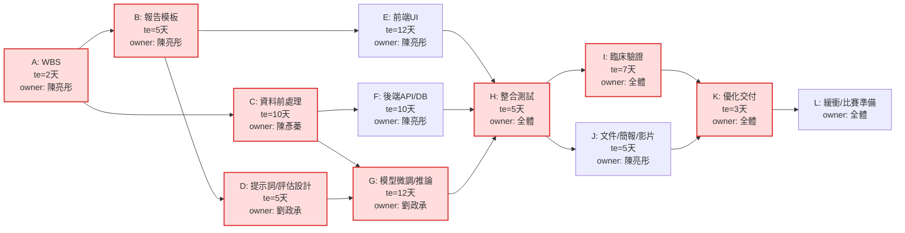
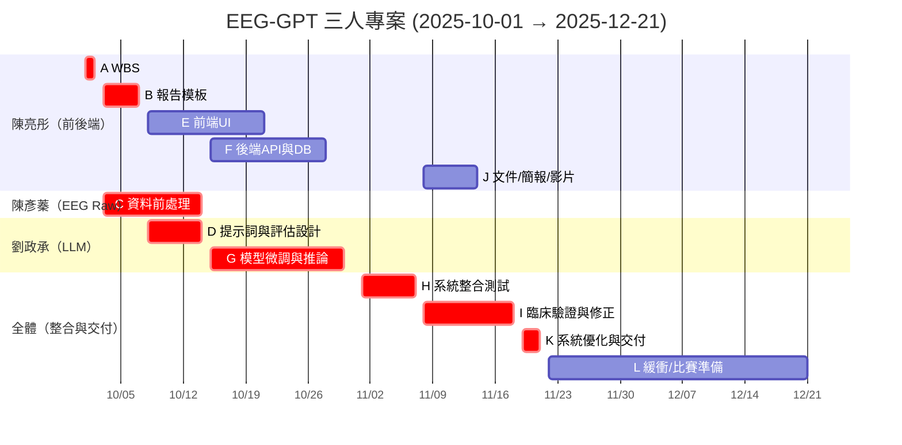

# EEG-GPT 三人專案排程（PERT/CPM、甘特圖）

> **日程**：2025-10-01 ～ 2025-12-21  
> **成員分工**：  
> - 陳彥蓁：EEG Raw 處理  
> - 劉政承：EEG Report 大語言模型訓練  
> - 陳亮彤：前後端  

---

## 1) 任務清單

> B:最佳、P:可能、W:最差；日期皆含當日。

| 任務ID | 任務名稱 | 負責 | 前置任務 | PERT(B/P/W) (天) | 期望工期 | 開始日期 | 結束日期 |
|:---:|---|:---:|:---:|:---:|:---:|:---:|:---:|
| A | 定義範疇與 工作分解 (WBS) | 陳&nbsp;亮&nbsp;彤 | — | 1/2/3 | 2.0 | 2025-10-01 | 2025-10-02 |
| B | EEG 報告 結構/模板 | 陳&nbsp;亮&nbsp;彤 | A | 3/5/7 | 5.0 | 2025-10-03 | 2025-10-07 |
| C | EEG 資料前處理流程 （匯入、濾波、標註、特徵） | 陳&nbsp;彥&nbsp;蓁 | A | 6/10/14 | 10.0 | 2025-10-03 | 2025-10-14 |
| D | LLM 提示詞與評估設計 （任務定義、指標、測試集） | 劉&nbsp;政&nbsp;承 | B | 3/5/7 | 5.0 | 2025-10-08 | 2025-10-14 |
| E | 前端 UI （表單、PDF Viewer、上傳流程） | 陳&nbsp;亮&nbsp;彤 | B | 7/12/15 | 12.0 | 2025-10-08 | 2025-10-21 |
| F | 後端 API 與資料庫整合 （上傳、查詢、產報告） | 陳&nbsp;亮&nbsp;彤 | C | 6/10/12 | 10.0 | 2025-10-15 | 2025-10-28 |
| G | 模型微調與推論模組 （資料打包、SFT/QLoRA、推論） | 劉&nbsp;政&nbsp;承 | C,D | 7/12/16 | 12.0 | 2025-10-15 | 2025-10-30 |
| H | 系統整合測試 （E+F+G 串接、E2E） | 全&nbsp;體 | E,F,G | 3/5/7 | 5.0 | 2025-11-01 | 2025-11-07 |
| I | 臨床驗證與修正 （場景測試、醫檢師回饋） | 全&nbsp;體 | H | 4/7/10 | 7.0 | 2025-11-08 | 2025-11-18 |
| J | 文件、簡報與影片 （操作手冊、Demo 影片） | 陳&nbsp;亮&nbsp;彤 | H | 3/5/7 | 5.0 | 2025-11-08 | 2025-11-14 |
| K | 系統優化與最終交付 （修 Bug、效能、封包） | 全&nbsp;體 | I,J | 2/3/5 | 3.0 | 2025-11-19 | 2025-11-21 |
| L | 緩衝與比賽準備 （醫師回饋細修、備援） | 全&nbsp;體 | K | — | 20.0 | 2025-11-22 | 2025-12-21 |

---

## 2) 三人份細節

### 陳彥蓁（EEG Raw 處理）
- 把原始 EEG 檔讀進來、去雜訊（濾波、去眼動/肌電）、切段。  
- 做基本標註（休息、刺激、入睡等），產出訓練要用的特徵。  
- 和後端討論資料格式（JSON/CSV），確保前端能讀。  
- **重點**：能穩定丟出乾淨特徵給模型（任務 C）。

### 劉政承（大語言模型訓練）
- 訂出任務定義與評估標準（BLEU/ROUGE/臨床核對表）。  
- 準備資料集、設計提示詞、進行模型微調（SFT/QLoRA）。  
- 開發推論 API，輸入 EEG 特徵 → 輸出結構化報告。  
- **重點**：微調完成 + 推論穩定（任務 D、G）。

### 陳亮彤（前後端）
- 前端：表單、PDF Viewer、上傳/下載流程。  
- 後端：API、資料庫 Schema、報告產檔（docx/pdf）。  
- 撰寫操作手冊、錄 Demo、做最終交付。  
- **重點**：UI 可操作、API 可用、整合順（任務 A,B,E,F,J,K）。

---

## 3) PERT/CPM 圖

---

## 4) 甘特圖

